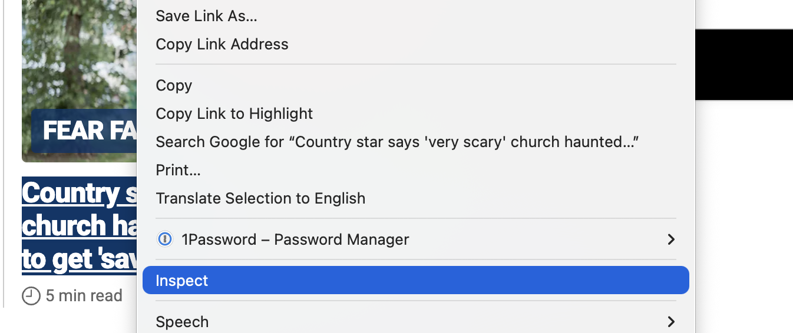
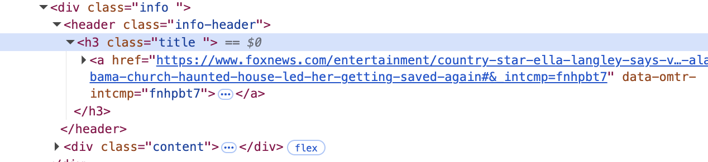
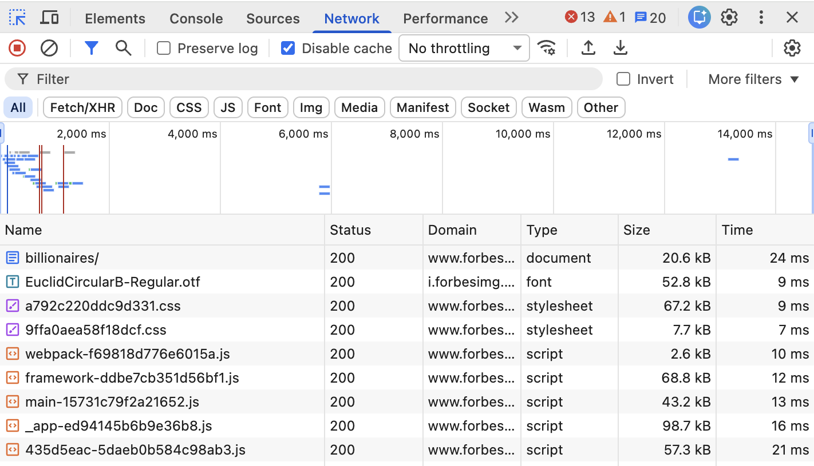
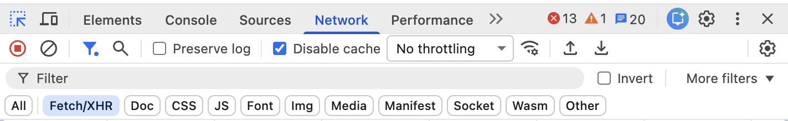
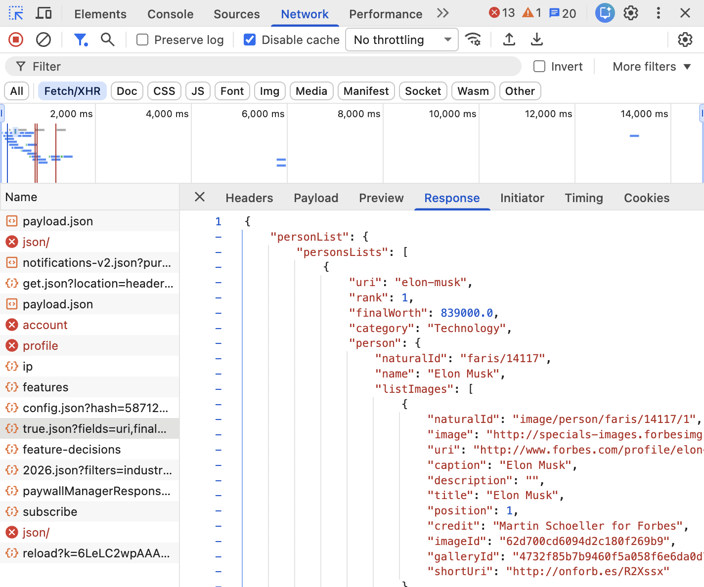

# Web Scraping

Web scraping involves scripting a browser to visit different sites and then save content from them.

## Basics

There are a ton of web scraping tools & programming libraries. For this workshop we'll be using the Python version of [Playwright](https://playwright.dev/python/docs/library), a library written by Microsoft that lets you automate various web browsers.

Here's a small script that loads up foxnews.com, and then quits:

```python
# import the playwright library
from playwright.sync_api import sync_playwright

# start playwright
playwright = sync_playwright().start()

# launch the chromium (chrome) browser, and make it visible
browser = playwright.chromium.launch(headless=False)

# open a new empty page
page = browser.new_page()

# visit a url
page.goto("https://www.foxnews.com/")

# stop playwright and close the browser
browser.close()
playwright.stop()
```

### Finding elements

To extract content from the page you need to find some elements you're interested in using css selectors (or other "locators"), and then extract the text from those elements.

Let's say we want to get all the headlines from foxnews.com. First, we need to figure out how headline elements are coded on the page. Start by visiting the site in your regular browser. Then, right-click on a headline, and from the drop-down menu select "Inspect".



You'll see a web inspector interface that shows the source code of the HTML for the element you've clicked on. Do the same thing for another headline. Try to find a pattern. In the case of foxnews you'll notice that all the headlines are contained within `<h3>` elements that have the class `title` like so: `<h3 class="title">Some headline</h3>`.



(With the web inspector open you can also mouse over other elements on the page and it will reveal their HTML code.)

Let's use this info to grab all the headlines and print them to the terminal.

```python
from playwright.sync_api import sync_playwright

playwright = sync_playwright().start()
browser = playwright.chromium.launch(headless=False)
page = browser.new_page()

page.goto("https://www.foxnews.com/")

# here's where we grab the headlines,
# we're looking for all h3 elements with the class "title"
items = page.locator("h3.title").all()

# go through every headline and print it to the terminal
for item in items:
    print(item.inner_text())

browser.close()
playwright.stop()
```

The `page.locator()` function takes a css selector as an argument and returns a list of elements matching that selector. `inner_text()` gets the text content for each element.

## Avoiding Detection (basics)

Many sites have built in protections to prevent automated web scraping. The absolute simplest way to avoid detection, that works for many but not all sites, is to change some settings when launching our browser, or to use Firefox instead of chrome. If you're running into issues, try one of these options.

Chrome, but with some new settings:

```python
from playwright.sync_api import sync_playwright

playwright = sync_playwright().start()

browser = playwright.chromium.launch(
    headless=False,
    args=["--disable-blink-features=AutomationControlled", "--disable-infobars"],
)
page = browser.new_page()

```

OR, Firefox:

```python
from playwright.sync_api import sync_playwright

playwright = sync_playwright().start()

# note that it says "firefox" down here instead of "chromium"!
browser = playwright.firefox.launch(headless=False)
page = browser.new_page()

```

Another tip: use the `page.wait_for_timeout()` function to pause the execution of your scripts. Slowing everything down a bit helps avoid detection.

```python
# sleep for 3 seconds (3000 milliseconds)
page.wait_for_timeout(3000)
```

## Finding Elements Without CSS

Sometimes it can be difficult to figure out the css selector for an element you're looking for. Playwright has a number of functions beyond `locator` to find elements based on other parameters, like the "role" they play on the page, or label text or placeholder text for form fields.

Here's a quick list from the [documentation](https://playwright.dev/python/docs/locators).

- `page.get_by_role()` to locate by explicit and implicit accessibility attributes.
- `page.get_by_text()` to locate by text content.
- `page.get_by_label()` to locate a form control by associated label's text.
- `page.get_by_placeholder()` to locate an input by placeholder.
- `page.get_by_alt_text()` to locate an element, usually image, by its text alternative.
- `page.get_by_title()` to locate an element by its title attribute.
- `page.get_by_test_id()` to locate an element based on its data-testid attribute (other attributes can be configured).

## Filling Out Forms & Clicking On Things

You can tell Playwright to fill out forms, like search bars, click buttons, hit the "Enter" key and perform other functions that simulate user behavior.

For example, Amazon has a search field at the top of their site. To locate it you can either find its css selector, or use the `searchbox` role, which is indicated in the HTML by an attribute `role=searchbox`.

You can then use the `fill()` function to type into the box, and finally press the "enter" key to submit the form:

```python
page.get_by_role("searchbox").fill("a consumer product")
page.get_by_role("searchbox").press("Enter")
```

## Pagination

You'll frequently need to grab more than a single page of results. To do this, you'll locate a "Next" button in the site's pagination section and then click on it. Each site will be different! Sometimes it's easiest to use the `get_by_text()` function.

Here's an example of clicking on a button with the text "Next" in it:

```python
page.get_by_text("Next").click()
```

In order to download paginated content you need to create a loop. Here's a simple way to do so, which grabs amazon product titles as an example:

(quick note: I'm using `page.wait_for_timeout()` here which pauses things in milliseconds, to help avoid bot detection)

```python
from playwright.sync_api import sync_playwright
playwright = sync_playwright().start()
browser = playwright.firefox.launch(headless=False)

page = browser.new_page()
page.goto("https://amazon.com")
page.wait_for_timeout(1000)

page.get_by_role("searchbox").fill("A consumer product")
page.get_by_role("searchbox").press("Enter")

current_page = 1

# get the first 10 pages of results
while current_page < 10:
  page.wait_for_timeout(2000)

  items = page.locator("a h2").all()

  for item in items:
    print(c.inner_text())

  page.get_by_text("Next").click()

  current_page += 1

browser.close()
playwright.stop()

```

## Saving Images

So far we've just copied text content, using the `inner_text()` function.

However, information about images are not stored as the inner text of elements, but inside the `src` attribute of the `img` tag.

```html

```

To download images, we need to extract these `src` attributes and then pass the urls of images to a download function. You can use the `get_attribute()` function on an element to extract the images' url.

Here's an example that downloads all images from a page:

```python

def download(url):
    local_filename = url.split("/")[-1]
    with requests.get(url, stream=True) as r:
        r.raise_for_status()
        with open(local_filename, "wb") as f:
            for chunk in r.iter_content(chunk_size=8192):
                f.write(chunk)

img_elements = page.locator("img").all()
for img in img_elements:
  src = img.get_attribute("src")
  download(src)

```

For the full code see `scrape_images.py` in the examples folder.

## Saving Data

Let's imagine the following scenario: a news website that lists article titles, author names, and user comments. The html might look something like this:

```html
<div class="articles">
  <div class="article">
    <h2 class="title">Article title</h2>
    <div class="author">Author Name</div>
    <div class="comments">10 comments</div>
  </div>

  <div class="article">
    <h2 class="title">Article title 2</h2>
    <div class="author">Another Author</div>
    <div class="comments">4 comments</div>
  </div>
</div>
```

We'd like to extract all the info we have for each article (title, author, total comments). In order to do this we can use a `page.locator()` looking for `divs` with `.article` class names, and then we can use locators on those elements to extract the individual data points:

```python
articles = page.locator(".article").all()

for article in articles:
  title = article.locator('.title').inner_text()
  author = article.locator('.author').inner_text()
  comments = article.locator('.comments').inner_text()
```

Next we need to find a good way to store this data. Let's make an empty list, and then use a python dictionary for each item.

```python

output = []

articles = page.locator(".article").all()

for article in articles:
  title = article.locator('.title').inner_text()
  author = article.locator('.author').inner_text()
  comments = article.locator('.comments').inner_text()

  item = {
    'title': title,
    'author': author,
    'comments': comments
  }

  output.append(item)
```

You can then save the `output` list as either a json or csv file.

JSON:

```python
import json

with open("articles.json", "w") as outfile:
  json.dump(output, outfile, indent=2)
```

CSV:

```python
import csv

with open("articles.csv", "w") as outfile:
  fieldnames = list(data[0].keys())
  writer = csv.DictWriter(outfile, fieldnames=fieldnames)
  writer.writeheader()
  writer.writerows(data)
```

## Advanced: Duplicating Network Requests

Websites will frequently load data in multiple stages. In the first stage, some basic HTML/CSS and JavaScript source gets loaded. In the second stage, JavaScript will make additional network requests that retrieve and insert the bulk of the site's content.

It can be more efficient to scrape sites that use this technique by attempting to detect the network requests being made, and then duplicate those requests directly from the command line or through a script. When it works, you'll download data directly and won't need to parse HTML at all.

### Inspecting Network Requests

To see what network requests your browser is making, first open up your developer tools. In Chrome, from the View menu, select Developer and then Developer Tools. Or, use the keyboard shortcut command-option-i.

Then click the Network button. You should see a list of all the requests your browser has made for the page you're on. Note that you may need to refresh the page after opening up the Network tab to see the requests.



The list should contain the initial HTML page, stylesheets, JavaScript files, images, and possibly much more. Typically this is a bit overwhelming. You can filter the list to only view specific requests by selecting requests types from the top bar. Click the "Fetch/XHR" button to just see the data requests.



Click on the network requests one by one. You'll see a side panel open up with more details about each request. In the panel they'll be a button called "Response" which actually shows you the data that the server sent back to your browser. Typically this will be a JSON file.



If you want to duplicate this in a Python script, right click on the request, then select "Copy", and then "Copy as cURL".

Visit [curlconverter](https://curlconverter.com/) and hit paste. CurlConverter will output a Python script that you can run on your computer.

As an example, here's a section of the output from CurlConverter from the Forbes Billionaire list (I've removed sections of it for brevity).

```python

response = requests.get(
    'https://www.forbes.com/forbesapi/person/billionaires/2026/rank/true.json?fields=uri,finalWorth,age,countryOfCitizenship,source,qas,rank,status,category,person,personName,industries,organization,gender,firstName,lastName,squareImage,bios&limit=50&start=0',
    cookies=cookies,
    headers=headers,
)
```

Notice the URL contains `limit=50&start=0`. From this we can surmise that the request is looking for the first 50 billionaires on the list. If we change the `start=0` to `start=50` we'll grab billionaires 50 to 100, and `start=100` will grab billionaires 100 to 150.

To actually save this data to your computer, add the following lines:

```python
import json

data = response.json()

with open("billionaires-0-to-50.json") as outfile:
  json.dump(data, outfile, indent=2)

```

Take a look at the file "forbes_requests.py" in the examples folder for the full example, including pagination.

## Very Advanced: Scraping Apps

You can also scrape hidden APIs from phone apps using a local proxy server, like [mitmproxy](https://www.mitmproxy.org/). For a tutorial on how to do this, take a look at [Intercepting iOS App Traffic with mitmproxy CLI & Web UI Guide](https://www.mrpbennett.dev/intercepting-ios-app-traffic-with-mitmproxy-cli-and-web-ui-guide).
